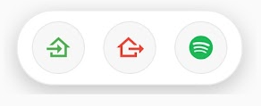
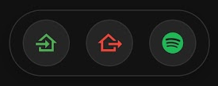

# TopBar Plugin for Kiosk Satellite

**TopBar** is a lightweight, floating control bar overlay plugin designed for [Kiosk Satellite](https://github.com/jxlarrea/kiosk-satellite) on Android tablets.

Control Bar for Home Assistant.

---

## ✨ Key Features

- **Floating Overlay Control**: Stays accessible over the main kiosk interface with glassmorphism design.
- **Home Assistant Integration**: Supports `script`, `scene`, `light`, and `switch` entities.
- **Live State Tracking**: Stateful entities (`light`, `switch`) automatically change color dynamically (Active Accent Color when ON, Muted Grey when OFF).
- **Stateless Actions**: Scripts and scenes (`script`, `scene`) always maintain their configured accent color.
- **Per-Button Auto-Hide**: Optionally toggle "Hide Menu on Click" per button, ideal for launching apps or full-screen views.
- **100% Offline Icons**: Embedded Material Design Icons font for instant 0ms icon rendering without internet.
- **Flexible Positioning**: Choose from 9 screen positions (Top, Middle, Bottom x Left, Center, Right).
- **Day/Night Theme Sync**: Automatically switches between dark and light themes based on Kiosk Satellite / Android system state.
- **Customizable**: Up to 5 buttons with native color picker, native HA entity search, and dynamic width auto-scaling.

---

## 🎨 Appearance (Light & Dark Theme)

| Light Theme | Dark Theme |
| :---: | :---: |
|  |  |

---

## ⚙️ Configuration

In **Kiosk Satellite > Plugin Manager > TopBar**, settings are organized into clean groups:

### General Settings
- **Theme**: `Auto (System / KS)`, `Dark`, or `Light`.
- **Position**: Choose from 9 screen grid positions (`Top Left`, `Top Center`, `Top Right`, `Middle Left`, `Middle Center`, `Middle Right`, `Bottom Left`, `Bottom Center`, `Bottom Right`).
- **Size**: `80%`, `100%`, or `120%`.

### Button Settings (Buttons 1 to 5)
Each button features dedicated native controls:
- **Icon**: Type any MDI icon name (e.g. `mdi:home`, `mdi:lightbulb`, `mdi:spotify`, `mdi:power`, `mdi:fan`, `mdi:lock`).
- **Color**: Native visual color picker or custom Hex value.
- **Action / Entity**: Searchable Home Assistant entity picker modal (`script`, `scene`, `light`, or `switch`).
- **Hide Menu on Click**: Switch toggle (`ON` / `OFF`) to automatically hide the bar when tapped.

> **Note:** The floating control bar automatically resizes its width to fit the exact number of active buttons configured (from 1 up to 5).

---

## 📱 Launching Android Apps on Kiosk Satellite via Home Assistant

To launch Android apps (like Spotify, NZB360, etc.) from Home Assistant and automatically hide the TopBar menu, create a script in Home Assistant:

```yaml
alias: "Abrir Spotify Kiosk"
sequence:
  - action: esphome.ks_casa_launch_app
    data:
      package_name: com.spotify.music
description: "Launches an Android application on the kiosk tablet."
```

Then in TopBar settings, select the script `script.abrir_spotify_kiosk` for your button and toggle **Hide Menu on Click** to `ON`.

---

## 🛠️ Requirements

- [Kiosk Satellite](https://github.com/jxlarrea/kiosk-satellite) (Android SDK 26+)
- Home Assistant instance with a Long-Lived Access Token.

---

## 📥 Installation

### Method 1: Via GitHub Repository (Recommended for Auto-Updates)

Installing via GitHub repository enables automatic update checks directly inside Kiosk Satellite.

1. Open **Kiosk Satellite** on your Android device.
2. Navigate to **Settings** > **Plugin Manager**.
3. Tap **Add plugin** and paste the GitHub repository URL:
   ```text
   https://github.com/nelsonamen/TopBar
   ```
4. Tap **Preview**, review the manifest, and tap **Trust and install**.
5. Enable **TopBar** on its entry row.

---

### Method 2: Manual ZIP Installation

1. Download the latest `top-bar-YYYY.MM.DD.zip` from the [Releases](https://github.com/nelsonamen/TopBar/releases) page.
2. Open **Kiosk Satellite** on your Android device.
3. Navigate to **Plugin Manager** > **Developer Tools** > **Install from ZIP**.
4. Select the downloaded ZIP file to install/update.
5. Enable **TopBar** on its entry row.

---

## ☕ Support Development

<div align="center">
  <p>These projects are open source and will stay that way. If they've earned a coffee, the button's right here:</p>
  <a href="https://www.buymeacoffee.com/nelsonamen" target="_blank">
    
  </a>
</div>

---

## 📄 License

Distributed under the MIT License.
